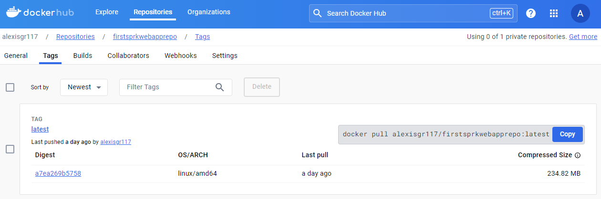
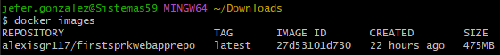
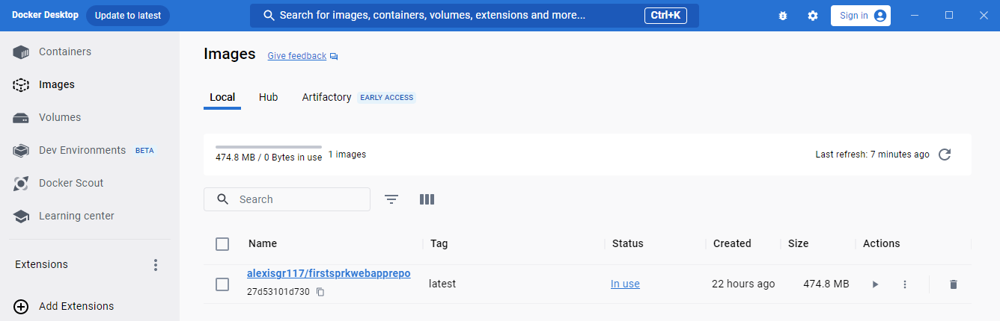
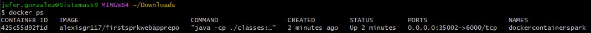
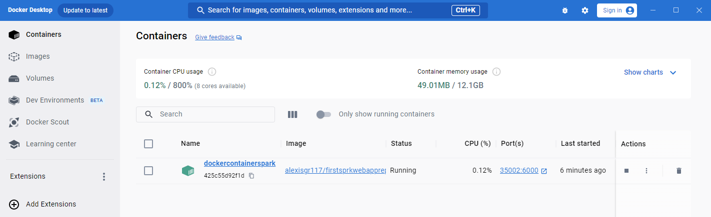
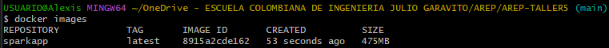
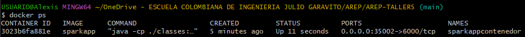
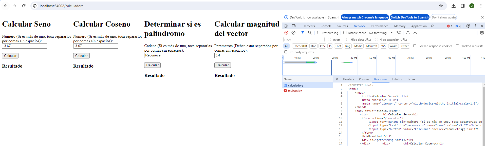
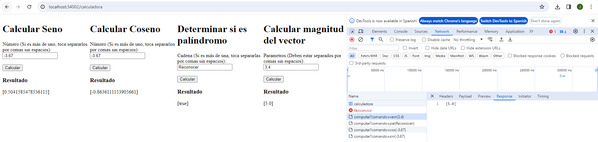

# TALLER 5: TALLER DE MODULARIZACIÓN CON VIRTUALIZACIÓN E INTRODUCCIÓN A DOCKER

Aplicación web pequeña que usa el micro-framework de Spark java (http://sparkjava.com/). Con la aplicaicón se crea un container para docker, se desplega y se configura en la máquina local. Luego, se crea un repositorio en DockerHub y se sube la imagen al repositorio.

## Comenzando

Estas instrucciones te ayudarán a obtener una copia del proyecto en funcionamiento en tu máquina local para fines de desarrollo y pruebas.

### Requisitos previos

- Kit de desarrollo de Java (JDK) versión 11 o posterior
- Herramienta de construcción Maven
- Docker Desktop

### Instalando

1. Asegúrate de tener Docker instalado en su máquina y que docker daemon esté ejecutándose.
2. Descargar la imagen de Docker del repositorio (opcional):
    ```
    docker pull alexisgr117/firstsprkwebapprepo:latest
    ```
    
    
3. Verifica que la imagen se haya creado correctamente ejecutando el siguiente comando:
    ```
    docker images
    ```
   debe verse algo así:

   
   
   También se puede hacer la verificación a través de Docker Desktop:

   
4. Crear un nuevo contenedor a partir de la imagen que está en Docker Hub:
    ```
    docker run -d -p 35002:6000 --name dockercontainerspark alexisgr117/firstsprkwebapprepo
    ```
5. Asegúrese que el contenedor está corriendo
    ```
    docker ps
    ```
   debe verse algo así:

   

   También se puede hacer la verificación a través de Docker Desktop:

   
6. Abre un navegador web y accede a la aplicación en http://localhost:35002/calculadora.

### Generar las imágenes

1. Asegúrate de tener Docker instalado en su máquina y que docker daemon esté ejecutándose.
2. Clona el repositorio:
    ```
    git clone https://github.com/AlexisGR117/AREP-TALLER5.git
    ```
3. Navega a la carpeta del proyecto:
    ```
    cd AREP-TALLER4
    ```
4. Construye el proyecto usando Maven:
    ```
    mvn clean install 
    ```
5. Usando la herramienta de línea de comandos de Docker construye la imagen (Reemplace <nombre-imagen> con el nombre que desea darle a la imagen):
    ```
    docker build --tag <nombre-imagen> .
    ```
6. Verifica que la imagen se haya creado correctamente ejecutando el siguiente comando:
    ```
    docker images
    ```
   debe verse algo así:

   
7. Ya si se desea crear un contenedor con la imágen (Reemplace <nombre-contenedor> y <nombre-imagen> con el nombre que desea darle al contenedor y el nombre de la imagen que se creó previamente):
    ```
    docker run -d -p 35002:6000 --name <nombre-contenedor> <nombre-imagen>
    ```
8. Asegúrese que el contenedor está corriendo
    ```
    docker ps
    ```
   debe verse algo así:

   
9. Abre un navegador web y accede a la aplicación en http://localhost:35002/calculadora.

## Arquitectura

La aplicación es una web app simple desarrollada con el micro-framework Spark Java y posteriormente contenerizada en Docker. Se compone de los siguientes componentes:

1. Frontend:
   - Implementado con HTML y Javascript.
   - Proporciona una interfaz gráfica para interactuar con la aplicación.
   - Permite ingresar valores y enviar peticiones a través de formularios.
   - Muestra los resultados obtenidos por las operaciones realizadas por el backend.
2. Backend:
   - Desarrollado con Spark Java.
   - Define dos endpoints:
     - /calculadora: Muestra la interfaz gráfica inicial.
     - /computar: Recibe las peticiones del cliente, procesa los datos y retorna el resultado.
   - Utiliza métodos de reflexión para invocar funciones matemáticas de la librería Java Math en base al comando recibido.
   - Maneja operaciones como:
     - Cálculo de seno y coseno.
     - Determinar si una cadena es palíndromo.
     - Calcular la magnitud de un vector
3. Docker:
   - Se utiliza para empaquetar la aplicación en un contenedor estandarizado.
   - El Dockerfile define las instrucciones para construir la imagen del contenedor, incluyendo las dependencias y la configuración de la aplicación.

## Evaluación

### Caso de prueba 1:

**Objetivo:** Verificar que la API /calculadora funciona correctamente.

**Entrada:** Solicitud a la API /calculadora sin parámetros.

**Salida:** La API debe devolver una respuesta HTTP 200 con el contenido de la página web.



Se realizó la petición a http://localhost:35002/calculadora la cual obtuvo como respuesta exitosa el contenido de la página web.

### Caso de prueba 2:

**Objetivo:** Verificar que los diferentes cálculos funciona correctamente.

**Entrada:** Solicitud para cada uno de los diferentes cálculos que se pueden hacer.

**Salida:** Se deben mostrar los diferentes resultados de los cálculos correctamente.



Se realizaron las peticiones GET para cada uno de los cáculos al ingresar los valores correspondientes y oprimir los botones calcular, de esto se obtuvo como respuesta exitosa los resultados de los diferentes cálculos.

## Construido con

- Java 11
- Maven
- Docker

## Autores

* Jefer Alexis Gonzalez Romero
